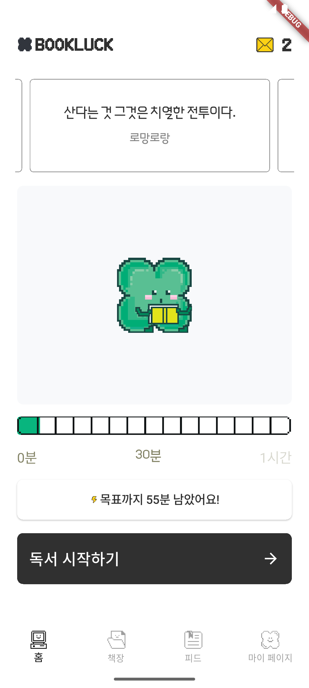
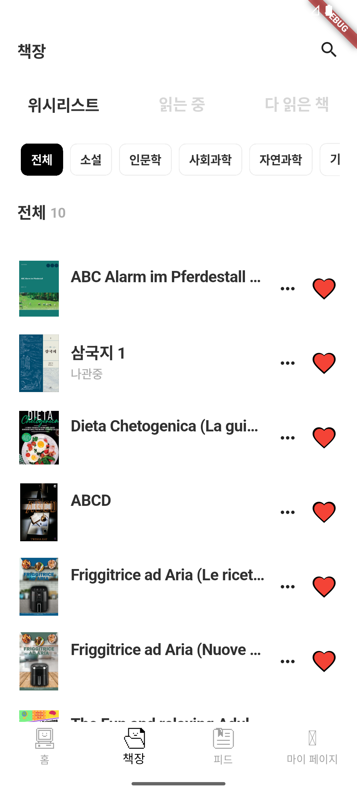
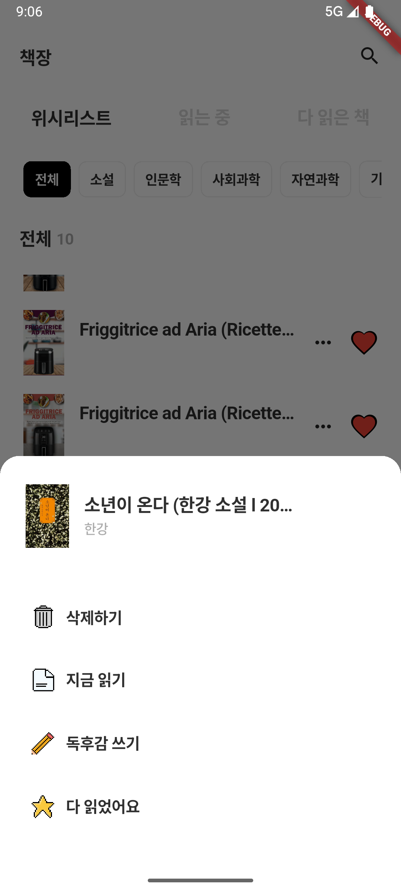
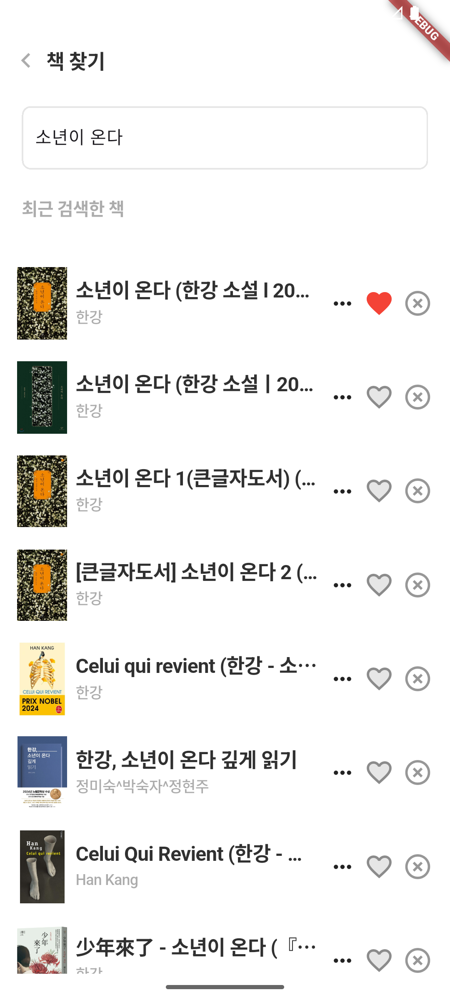

# 🍀 **Book Luck App - 독서 관리 앱**

책을 읽으면 행운이 찾아옵니다. **Book Luck App**은 독서 습관을 기록하고, 독서 데이터를 통해 자기 계발을 돕는 앱입니다.

📚 **책을 읽고 기록하면, 더 많은 행운이 찾아올지도 몰라요!**

> 현재 진행 중인 사이드 프로젝트입니다. 2024년 6월, 카카오톡 오픈채팅방에서 우연히 만난 4명의 직장인이 함께 개발하고 있습니다. 모두 본업이 있는 상태에서 시간을 쪼개가며 작업하고 있어 진행 속도는 빠르지 않지만, 꾸준히 앱 배포를 목표로 나아가고 있습니다. 아직 많은 기능이 개발 중이며 개선할 부분도 많지만, 기본 레이아웃과 대시보드 정도 구현된 상태입니다.

<br><br>

## ✨ 주요 기능
- 📖 **책 목록 관리**: 읽고 있는 책, 읽은 책, 읽을 책을 목록에 추가하고 관리할 수 있습니다.
- ⏳ **독서 시간 기록**: 책을 읽은 시간을 기록하고, 독서 습관을 추적할 수 있습니다.
- 📝 **책 내용 기록**: 중요한 내용을 기록하고, 개인적인 독서 노트를 남길 수 있습니다.
- 📊 **독서 통계 제공**: 읽은 책의 수, 독서 시간, 페이지 수 등의 통계를 시각적으로 제공합니다.
- 🎯 **독서 목표 설정**: 월별, 연별 목표를 설정하고 달성 여부를 확인할 수 있습니다.

<br><br>

## 🏗 프로젝트 개요

- **팀 구성**:
  - **디자이너**: 2명
  - **백엔드**: 1명
  - **프론트엔드**: 1명 (Flutter 개발)

    > 본업으로는 React를 사용해 웹 관리자 페이지를 개발해 오고 있지만, 개인적으로 책 읽는 것을 좋아하고 모바일 앱 개발에도 관심이 많아 Flutter를 독학하며 도전 중입니다. 처음에는 React Native로 시작했지만, 더 나은 성능과 크로스플랫폼 개발의 장점을 고려해 Flutter로 전환했습니다. 새로운 기술을 배우고 적용하는 과정을 즐기며, 실전 경험을 쌓기 위해 꾸준히 프로젝트를 진행하고 있습니다. 😊


- **기술 스택**:
  - **디자인**: Figma
  - **프론트엔드**: Flutter
  - **백엔드**: Spring Boot, MySQL

- **지원 플랫폼**:
  - Android
  - iOS

<br><br>

## 🚀 설치 및 실행 방법

### 1️⃣ 저장소 클론
```bash
git clone https://github.com/Jeehay28/book-luck-app.git
```

<br>

### 2️⃣ 의존성 설치
Flutter가 설치되어 있는지 확인 후, 다음 명령어를 실행하세요.
```bash
flutter pub get
```

<br>

### 3️⃣ 앱 실행
```bash
flutter run
```

<br><br>

## 📸 스크린샷
<p align="center">
  
  
  
  
</p>


**더 나은 독서 습관을 위해 개발 중입니다! 많은 관심 부탁드려요. 😊**

